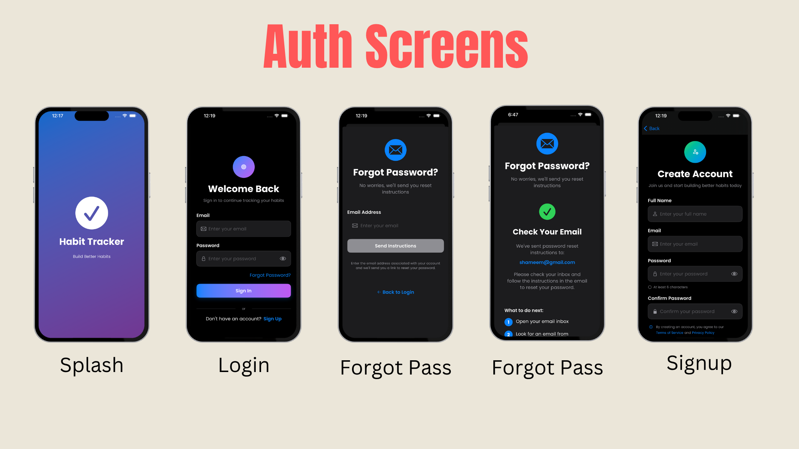
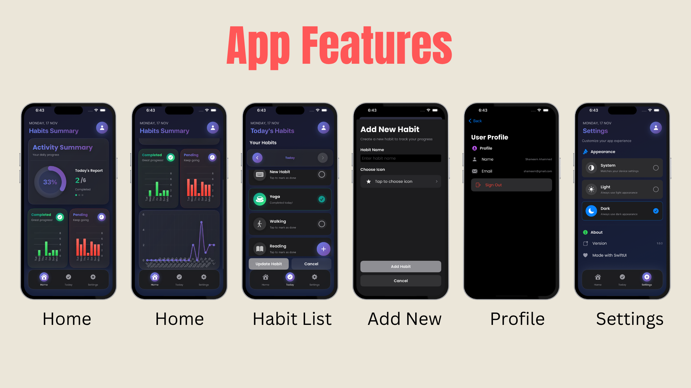

# 🎯 Habit Tracker

A clean, modern, and easy-to-use iOS app built with SwiftUI to help you build better habits. Track your daily routine, visualize your progress, and stay motivated with a beautiful, intuitive interface.


[](https://github.com/shameem17)
[](https://youtu.be/y-MUjBzlZFs)

## ✨ Features

### 📊 **Activity Tracking & Visualization**

- **Daily Habit Tracking** — Mark habits as done or not done with a simple tap.
- **Progress Ring** — A smooth, animated ring that visually shows your daily progress.
- **7-Day Trend Chart** — A clean line chart showing how consistent you’ve been over the week.
- **Activity Summary** — Live summary cards that show how many habits you’ve completed or missed.
- **Date Navigation** — Easily jump back through the past 7 days to review your progress.

### ✅ **Habit Management**

- **Add Custom Habits** — Create your own habits with personalized names and SF Symbol icons.
- **Icon Picker** — Browse a large, organized library of 150+ icons with search support.
- **Time-Based Habits** — Dedicated options for habits like “Bed Time” and “Wakeup Time.”
- **Update Habits** — Change habit status for any chosen date.




### 🔐 **Authentication & Security**

- **User Authentication** — Simple and secure login/signup system.
- **Token Management** — Automatically refreshes tokens when needed.
- **Forgot Password** — Reset your password through email.
- **Persistent Sessions** — Stay logged in even after closing the app.
- **Profile Management** — View user details and log out easily.

### 📱 **Navigation & Organization**

- **Tab Navigation** — Switch effortlessly between Summary, Today, and Settings.
- **Day Slider** — Move between dates quickly, with a shortcut to return to Today.
- **Date Paginator** — Navigate your habit history using back/forward buttons.
- **Profile Screen** — A full-screen, easy-to-navigate user profile.
- **Modal Sheets** — Clean pop-ups for adding habits and resetting passwords.

## 🛠 Frameworks & Technologies

### **Core Frameworks**

- **SwiftUI** — Building the UI using Apple’s modern declarative framework.
- **Combine** — Handling data updates reactively across the app.
- **Foundation** — Core utilities and system functionality.

### **Networking**

- **URLSession** — Handles API requests and responses.
- **JSONSerialization** — Manages JSON-based data.
- **Custom Network Layer** — A clean, reusable networking system with retry support.

### **Data Management**

- **UserDefaults** — Stores user preferences and session tokens.
- **Singleton Pattern** — `HabitDataManager` as the central data controller.
- **MVVM Architecture** — Organizes the app for clarity and scalability.

### **UI Components**

- **Custom Charts** — Smooth line charts and progress rings built with SwiftUI.
- **SF Symbols** — Apple’s built-in icon library.
- **GeometryReader** — Creates responsive layouts based on screen size.
- **LazyVStack** — Optimized for smooth scrolling with large lists.

### **Authentication & Security**

- **Token-Based Auth** — Secure JWT tokens for access and refresh.
- **Secure Storage** — Tokens stored safely using UserDefaults.
- **Auto Token Refresh** — Automatically retries protected API calls on failure.

## 🏗 Architecture

### **MVVM (Model-View-ViewModel)**

```
├── Networks/
│   ├── BaseRouter.swift
│   └── NetwrokService.swift
├── Models/
│   ├── Habit.swift
│   ├── Report.swift
│   └── User.swift
├── Views/
│   ├── HomeView.swift
│   ├── UpdateView.swift
│   ├── AddHabitView.swift
│   ├── LoginView.swift
│   └── Reusable Components
├── ViewModels/
│   ├── HomeViewModel.swift
│   ├── UpdateViewModel.swift
│   ├── AddHabitViewModel.swift
│   └── AuthViewModel.swift
├── Services/
│   ├── NetworkService.swift
│   ├── HabitDataManager.swift
│   ├── AuthService.swift
│   └── PDFGeneratorService.swift
└── Extensions/
    ├── Color+Hex.swift
    ├── Font+Poppins.swift
    └── Font+OpenSans.swift
```

### **Key Design Patterns**

- **Singleton** — Shared data manager for a unified source of truth.
- **Protocol-Oriented Design** — Easier testing and cleaner structure.
- **Dependency Injection** — ViewModels injected using SwiftUI property wrappers.
- **Observer Pattern** — Live UI updates powered by Combine.
- **Router Pattern** — Clean API endpoint management.

## 🎯 Key Features Breakdown

### **Centralized Data Management**

All habit and report data lives inside `HabitDataManager.shared`, giving you:

- A single, reliable source of truth
- Automatic syncing across screens
- Real-time updates using Combine
- Efficient API calls with cached data

### **Scalable**

- Reusable components for both UI and networking.

### **Smart Network Layer**

- Centralized network logic
- Custom routers built on top of `BaseRouter`

### **Smart API Integration**

- Automatically refreshes tokens when needed
- Retries failed requests with exponential backoff
- Ensures safe background work and main-thread UI updates

### **Modern Animations**

- Smooth number-count animations
- Spring-based transitions
- Matched geometry effects
- Elegant gradient animations

## 📦 Installation

1. Clone the repo
2. Open `HabitTracker.xcodeproj` in Xcode
3. Build and run on an iOS 15+ device or simulator

## 🚀 Future Enhancements

- Push notifications for reminders
- Habit streak tracking
- Social challenges and sharing
- Home screen widgets
- Apple Watch companion app
- iCloud sync across devices
- Report Generation & Export

---

**Built with ❤️ using SwiftUI** [](https://github.com/shameem17) [](https://youtu.be/y-MUjBzlZFs)
